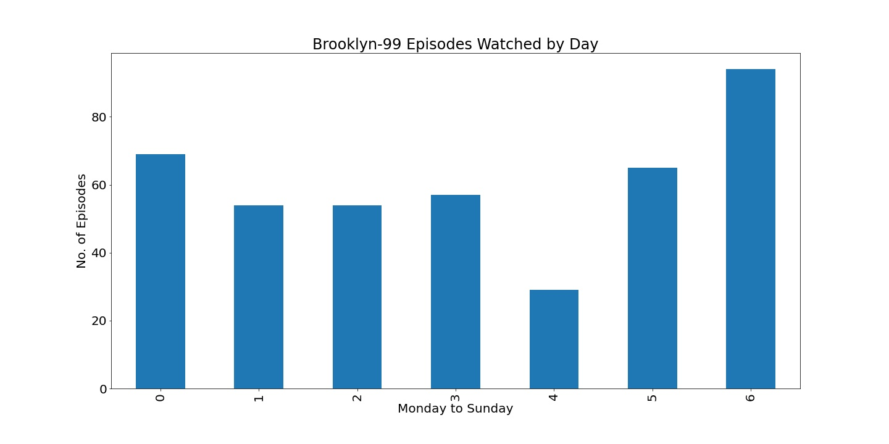
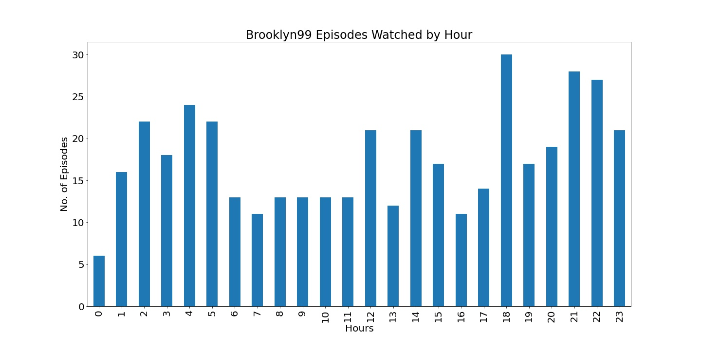

# Netflix-Data-Analysis
Journey of my Data Visualization through several part project with my Netflix dataset. 
This is the first part where I visualized a particular show watch time by total episodes vs days and vs hours.  

* Total episodes watch each day of the week.
  

* Total episodes wacth at each hour of the day. 

